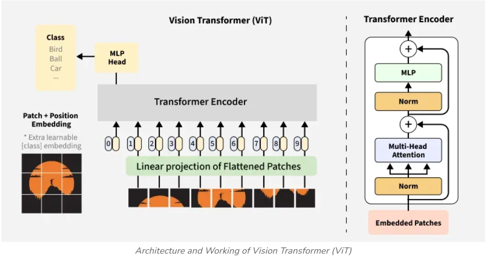

<div align="center">

# 🧠 Vision Transformer (ViT) — From Scratch  


A **from-scratch implementation** of the **Vision Transformer (ViT)** using **PyTorch**, trained and evaluated on the **MNIST** dataset.  
This project demonstrates how transformer-based architectures can replace traditional convolutional networks for image classification.

</div>

---

## 🧩 Overview  

This project shows how to **build, train, and evaluate** a Vision Transformer that classifies handwritten digits (0–9) from the MNIST dataset.  
It includes both a **Jupyter Notebook** for step-by-step learning and a **Python script** for standalone execution.  
A ViT architecture diagram is also included for visualization.

---

## 📁 Files  

| File | Description |
|------|--------------|
| `vit_from_scratch.ipynb` | Jupyter Notebook version with explanations and training steps |
| `vit_architecture/1.png` | Vision Transformer architecture diagram |

---

## 🖼️ Vision Transformer Architecture  

The Vision Transformer divides an image into small patches, embeds them, and processes them as a **sequence**, similar to tokens in NLP transformers.  
Each patch acts as a token that participates in self-attention, helping the model learn spatial relationships across the image.

<p align="center">
  
</p>

<details>
<summary><b>🔍 Core Components</b></summary>

- **Patch Embedding:** Uses a convolutional layer to divide the image into patches and convert them into embeddings.  
- **Positional Embedding:** Adds positional information to preserve spatial order.  
- **Transformer Encoder:** A stack of multi-head self-attention and feedforward layers, with layer normalization and residual connections.  
- **CLS Token:** A learnable token that represents the overall image for classification.  
- **MLP Head:** Fully connected layers for the final classification task.  

</details>

---

## ⚙️ Model Configuration  

| Parameter | Value |
|------------|--------|
| Image Size | 28×28 |
| Patch Size | 7×7 |
| Embedding Dimension | 16 |
| Attention Heads | 4 |
| Transformer Blocks | 4 |
| Hidden Nodes (MLP) | 64 |
| Number of Classes | 10 |
| Optimizer | Adam |
| Learning Rate | 0.001 |
| Epochs | 10 |

---

## 🚀 Training Details  

The model uses **CrossEntropyLoss** and the **Adam** optimizer.  
It supports both **CPU** and **GPU** training.  

During each epoch, it reports batch-wise loss and accuracy along with a summary.  
After 10 epochs, it typically achieves around **95% accuracy** on MNIST.

---

## 🏃 How to Run  

```bash
# Clone the repository
git clone https://github.com/<your-username>/vit_from_scratch.git
cd vit_from_scratch

# Run the notebook
jupyter notebook vit_from_scratch.ipynb
